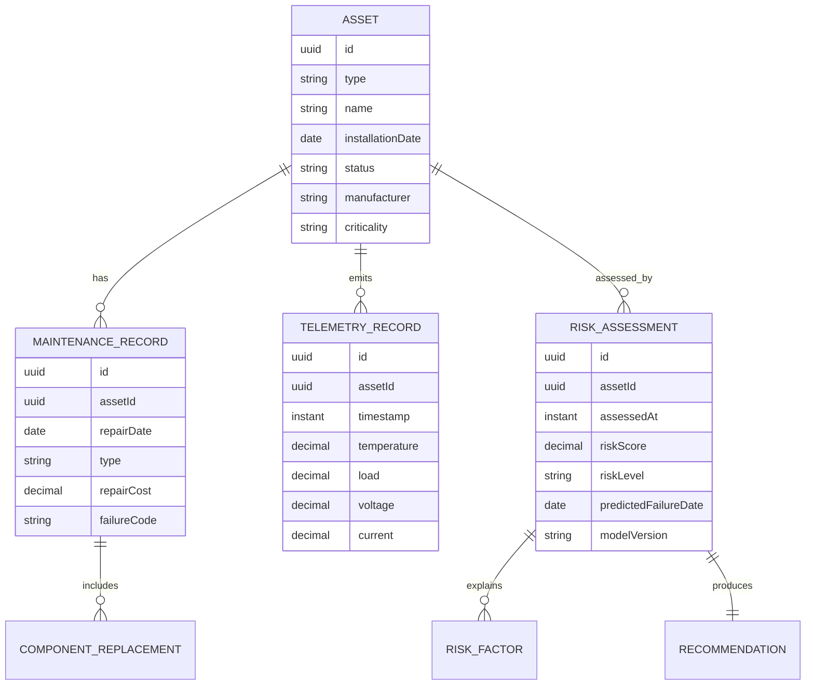

# Clean Architecture проекта «AI-платформа интеллектуального управления активами электрических сетей»

## 1. Архитектурные цели

Платформа проектируется как backend-first система на Java 21 и Spring Boot с явным разделением бизнес-логики, сценариев приложения, инфраструктуры и AI-компонентов. Ключевые цели архитектуры:

- изолировать доменную модель от Spring, JPA, Kafka, REST и внешних AI-сервисов;
- обеспечить заменяемость rule-based AI на ML/анализ аномалий без переписывания use cases;
- поддержать высокую скорость приема телеметрии через Kafka и асинхронные пайплайны обработки;
- сохранить аудитируемость решений: риск, рекомендация и объяснение должны быть воспроизводимыми;
- подготовить систему к production: миграции БД, наблюдаемость, безопасность, отказоустойчивость, идемпотентность.

## 2. Слои Clean Architecture

Зависимости направлены внутрь: `infrastructure -> application -> domain`, а AI-ядро подключается через application ports. Domain не зависит ни от Spring, ни от базы данных, ни от Kafka.

```text
+-------------------------------------------------------------+
| Infrastructure                                              |
| REST controllers, JPA adapters, Kafka, security, config      |
+-------------------------- depends on ------------------------+
| Application                                                 |
| Use cases, DTO, ports, orchestration, transactions           |
+-------------------------- depends on ------------------------+
| Domain                                                      |
| Entities, value objects, invariants, domain services, events |
+-------------------------------------------------------------+

AI/Core rule engine реализует application output ports и может жить как in-process модуль
или как adapter к внешнему Python/FastAPI ML-сервису.
```

### 2.1 Domain layer

Ответственность:

- описывает бизнес-сущности электросетевых активов и их жизненный цикл;
- хранит value objects: `AssetId`, `AssetType`, `RiskLevel`, `GeoLocation`, `TelemetryMetric`, `Money`;
- защищает инварианты: допустимые статусы, корректные даты ремонта, валидные диапазоны телеметрии;
- содержит domain services для расчета производных показателей, если они не зависят от инфраструктуры;
- публикует domain events: `AssetRegistered`, `TelemetryReceived`, `RiskLevelChanged`, `MaintenanceCompleted`.

Domain не содержит JPA-аннотаций, Spring-компонентов, REST DTO и Kafka-классов.

### 2.2 Application layer

Ответственность:

- реализует use cases: регистрация актива, запись ремонта, прием телеметрии, оценка риска, построение очереди ремонтов;
- содержит input ports, output ports и application DTO/commands/queries;
- координирует транзакции и вызывает доменные сервисы;
- не знает конкретной реализации PostgreSQL, Kafka или AI-модели;
- обеспечивает идемпотентность команд, например по `externalTelemetryId` или `eventId`.

Типичные ports:

- `AssetRepositoryPort`, `MaintenanceRepositoryPort`, `TelemetryRepositoryPort`, `RiskAssessmentRepositoryPort`;
- `RiskScoringPort`, `AnomalyDetectionPort`, `RecommendationPort`;
- `DomainEventPublisherPort`, `TelemetryStreamPublisherPort`, `AuditLogPort`.

### 2.3 Core / AI layer

Ответственность:

- реализует rule-based risk scoring первой версии;
- рассчитывает риск отказа, причины риска, рекомендации и приоритет обслуживания;
- агрегирует признаки: возраст, количество ремонтов за период, температура, нагрузка, перегревы;
- предоставляет explainability: список сработавших правил и входные признаки;
- изолирует будущие ML-модели за стабильными application ports.

В MVP AI/Core может быть Java-модулем внутри backend. В дальнейшем порт `RiskScoringPort` может быть реализован HTTP/gRPC-адаптером к Python FastAPI-сервису со scikit-learn/XGBoost.

### 2.4 Infrastructure layer

Ответственность:

- REST API на Spring MVC или WebFlux;
- persistence adapters на Spring Data JPA/Hibernate и PostgreSQL;
- Kafka producers/consumers для телеметрии и событий риска;
- OpenAPI/Swagger, Spring Security, OAuth2/JWT, rate limiting;
- Docker, миграции Flyway/Liquibase, health checks, metrics, tracing;
- mapping между JPA entities / REST DTO / Kafka messages и application DTO/domain model.

Infrastructure зависит от application ports и предоставляет их реализации.

## 3. Рекомендуемая package structure

Базовый пакет лучше нормализовать в нижний регистр: `com.powerassetintelligence`.

```text
com.powerassetintelligence
├── PowerAssetIntelligenceApplication.java
├── domain
│   ├── asset
│   │   ├── Asset.java
│   │   ├── AssetId.java
│   │   ├── AssetType.java
│   │   ├── AssetStatus.java
│   │   └── TechnicalParameter.java
│   ├── maintenance
│   │   ├── MaintenanceRecord.java
│   │   ├── MaintenanceType.java
│   │   └── ComponentReplacement.java
│   ├── telemetry
│   │   ├── TelemetryRecord.java
│   │   ├── TelemetrySnapshot.java
│   │   └── OverheatingEvent.java
│   ├── risk
│   │   ├── RiskAssessment.java
│   │   ├── RiskLevel.java
│   │   ├── RiskFactor.java
│   │   └── Recommendation.java
│   ├── shared
│   │   ├── Money.java
│   │   ├── GeoLocation.java
│   │   ├── DomainEvent.java
│   │   └── BusinessRuleViolationException.java
│   └── service
│       ├── AssetCriticalityPolicy.java
│       └── MaintenancePriorityPolicy.java
├── application
│   ├── port
│   │   ├── in
│   │   │   ├── RegisterAssetUseCase.java
│   │   │   ├── RecordMaintenanceUseCase.java
│   │   │   ├── IngestTelemetryUseCase.java
│   │   │   └── AssessRiskUseCase.java
│   │   └── out
│   │       ├── AssetRepositoryPort.java
│   │       ├── TelemetryRepositoryPort.java
│   │       ├── RiskScoringPort.java
│   │       ├── DomainEventPublisherPort.java
│   │       └── TelemetryStreamPublisherPort.java
│   ├── command
│   │   ├── RegisterAssetCommand.java
│   │   ├── RecordMaintenanceCommand.java
│   │   └── IngestTelemetryCommand.java
│   ├── query
│   │   ├── GetAssetQuery.java
│   │   └── GetRiskAssessmentQuery.java
│   ├── dto
│   │   ├── AssetDto.java
│   │   ├── TelemetryDto.java
│   │   └── RiskAssessmentDto.java
│   └── service
│       ├── AssetApplicationService.java
│       ├── TelemetryApplicationService.java
│       └── RiskAnalysisApplicationService.java
├── core
│   └── ai
│       ├── RuleBasedRiskScoringService.java
│       ├── RiskFeatureExtractor.java
│       ├── RiskRule.java
│       ├── CoolingSystemInspectionRule.java
│       └── AgingOverheatRepairRule.java
└── infrastructure
    ├── web
    │   ├── AssetController.java
    │   ├── TelemetryController.java
    │   ├── RiskAnalysisController.java
    │   ├── dto
    │   └── error
    ├── persistence
    │   ├── jpa
    │   │   ├── AssetJpaEntity.java
    │   │   ├── MaintenanceJpaEntity.java
    │   │   ├── TelemetryJpaEntity.java
    │   │   └── RiskAssessmentJpaEntity.java
    │   ├── repository
    │   ├── mapper
    │   └── adapter
    ├── messaging
    │   ├── kafka
    │   │   ├── TelemetryConsumer.java
    │   │   ├── TelemetryProducer.java
    │   │   ├── RiskAssessmentProducer.java
    │   │   └── message
    │   └── outbox
    ├── ai
    │   ├── FastApiRiskScoringClient.java
    │   └── AiModuleProperties.java
    ├── security
    ├── observability
    └── config
```

## 4. Основные domain entities и value objects

### 4.1 Asset

Агрегатный корень для оборудования.

Поля:

- `AssetId id`;
- `AssetType type` — transformer, substation, breaker, overhead line, cable line, switchgear, sensor;
- `String name`;
- `LocalDate installationDate`;
- `AssetStatus status` — active, warning, critical, under_maintenance, decommissioned;
- `GeoLocation location`;
- `String manufacturer`;
- `Map<String, TechnicalParameter> technicalParameters`;
- `AssetCriticality criticality`;
- `Integer expectedServiceLifeYears`.

Инварианты:

- дата ввода не может быть в будущем;
- выведенный из эксплуатации актив не принимает эксплуатационную телеметрию;
- критичность должна быть задана для активов, участвующих в приоритизации ремонтов.

### 4.2 MaintenanceRecord

Запись истории обслуживания.

Поля:

- `MaintenanceRecordId id`;
- `AssetId assetId`;
- `LocalDate repairDate`;
- `MaintenanceType type`;
- `String description`;
- `Money repairCost`;
- `List<ComponentReplacement> replacedComponents`;
- `FailureCode failureCode`;
- `String performedBy`.

Инварианты:

- дата ремонта не раньше даты установки актива;
- стоимость не отрицательная;
- замена компонента должна указывать компонент и новый серийный номер, если он известен.

### 4.3 TelemetryRecord

Запись показаний датчиков.

Поля:

- `TelemetryRecordId id`;
- `AssetId assetId`;
- `Instant timestamp`;
- `BigDecimal temperatureCelsius`;
- `BigDecimal loadPercent`;
- `BigDecimal voltageKv`;
- `BigDecimal currentAmpere`;
- `BigDecimal vibrationMmSec`;
- `Integer overheatingCount`;
- `String sourceSensorId`;
- `String externalTelemetryId`.

Инварианты:

- нагрузка должна быть в диапазоне 0..150%, где значения выше 100% допустимы как аварийная перегрузка;
- температура и напряжение валидируются по типу оборудования;
- `externalTelemetryId` используется для идемпотентной загрузки.

### 4.4 RiskAssessment

Результат AI-анализа.

Поля:

- `RiskAssessmentId id`;
- `AssetId assetId`;
- `Instant assessedAt`;
- `BigDecimal riskScore` — 0..100;
- `RiskLevel riskLevel` — low, medium, high, critical;
- `List<RiskFactor> riskFactors`;
- `Recommendation recommendation`;
- `LocalDate predictedFailureDate`;
- `String modelVersion`;
- `String explanation`.

Инварианты:

- score должен соответствовать уровню риска по заданной шкале;
- результат должен хранить версию модели/правил;
- для HIGH/CRITICAL должен быть сформирован actionable recommendation.

### 4.5 Связи между сущностями



## 5. REST API

REST API должен быть thin adapter: контроллеры принимают request DTO, валидируют базовые constraints и вызывают application use cases.

### 5.1 Assets

| Method | Path | Назначение |
|---|---|---|
| `POST` | `/api/v1/assets` | Создать актив |
| `GET` | `/api/v1/assets` | Получить страницу активов с фильтрами |
| `GET` | `/api/v1/assets/{assetId}` | Получить карточку актива |
| `PATCH` | `/api/v1/assets/{assetId}` | Обновить параметры актива |
| `POST` | `/api/v1/assets/{assetId}/decommission` | Вывести актив из эксплуатации |
| `GET` | `/api/v1/assets/{assetId}/history` | Получить эксплуатационную историю |

Фильтры списка: `type`, `status`, `criticality`, `location`, `manufacturer`, `riskLevel`, `installedBefore`, `page`, `size`, `sort`.

Пример создания:

```json
{
  "type": "TRANSFORMER",
  "name": "Transformer T-101",
  "installationDate": "2008-04-12",
  "location": {
    "region": "Moscow Grid Area",
    "substation": "PS-12",
    "latitude": 55.751244,
    "longitude": 37.618423
  },
  "manufacturer": "ABB",
  "expectedServiceLifeYears": 30,
  "criticality": "HIGH",
  "technicalParameters": {
    "ratedPowerMva": "40",
    "ratedVoltageKv": "110"
  }
}
```

### 5.2 Maintenance

| Method | Path | Назначение |
|---|---|---|
| `POST` | `/api/v1/assets/{assetId}/maintenance-records` | Зарегистрировать ремонт/диагностику |
| `GET` | `/api/v1/assets/{assetId}/maintenance-records` | История обслуживания актива |
| `GET` | `/api/v1/maintenance-records` | Общий журнал обслуживания |

### 5.3 Telemetry

| Method | Path | Назначение |
|---|---|---|
| `POST` | `/api/v1/telemetry` | Синхронная загрузка одной записи или batch |
| `GET` | `/api/v1/assets/{assetId}/telemetry` | Историческая телеметрия с агрегацией |
| `GET` | `/api/v1/assets/{assetId}/telemetry/latest` | Последнее состояние датчиков |

Для high-throughput сценария основной путь — Kafka, REST используется для ручной загрузки, тестирования и интеграций без брокера.

### 5.4 Risk analysis and recommendations

| Method | Path | Назначение |
|---|---|---|
| `POST` | `/api/v1/assets/{assetId}/risk-assessments` | Запустить переоценку риска |
| `GET` | `/api/v1/assets/{assetId}/risk-assessments/latest` | Получить последнюю оценку риска |
| `GET` | `/api/v1/assets/{assetId}/risk-assessments` | История оценок риска |
| `GET` | `/api/v1/risk-assessments/top-risky` | Наиболее проблемные активы |
| `GET` | `/api/v1/maintenance-priorities` | Очередь обслуживания |
| `GET` | `/api/v1/reports/failures` | Статистика отказов |
| `GET` | `/api/v1/reports/maintenance-cost-forecast` | Прогноз затрат |

### 5.5 API production requirements

- OpenAPI 3 должен публиковаться через `/swagger-ui.html` и `/v3/api-docs`;
- ошибки должны возвращаться в формате RFC 7807 Problem Details;
- все изменяющие операции должны иметь audit trail;
- для batch telemetry стоит поддержать лимит размера запроса и backpressure;
- external API должен версионироваться через `/api/v1`.

## 6. Event-driven architecture для телеметрии

### 6.1 Kafka topics

| Topic | Key | Producer | Consumer | Назначение |
|---|---|---|---|---|
| `telemetry.raw.v1` | `assetId` | IoT gateway, REST adapter | telemetry ingestion service | Сырые показания датчиков |
| `telemetry.validated.v1` | `assetId` | ingestion service | risk analysis, analytics | Валидная нормализованная телеметрия |
| `telemetry.rejected.v1` | `assetId` | ingestion service | support/monitoring | Некорректные сообщения |
| `asset.events.v1` | `assetId` | asset service | audit, analytics | Изменения активов |
| `risk.assessment.requested.v1` | `assetId` | telemetry/risk scheduler | risk engine | Запрос оценки риска |
| `risk.assessment.completed.v1` | `assetId` | risk engine | notification, maintenance planning | Завершенная оценка риска |
| `maintenance.priority.changed.v1` | `assetId` | maintenance planning | dashboard/notifications | Изменение очереди обслуживания |

### 6.2 Telemetry ingestion flow

```text
IoT Gateway / SCADA
    -> Kafka telemetry.raw.v1
    -> TelemetryConsumer
    -> validation + normalization + idempotency check
    -> PostgreSQL telemetry_records
    -> Kafka telemetry.validated.v1
    -> RiskAssessmentRequested event when thresholds or schedule require analysis
    -> Risk engine
    -> PostgreSQL risk_assessments
    -> Kafka risk.assessment.completed.v1
    -> dashboard / notifications / maintenance queue
```

### 6.3 Message contract: telemetry.raw.v1

```json
{
  "eventId": "b90e7e65-23b2-4ba0-bceb-32a8fd6098de",
  "schemaVersion": "1.0",
  "assetId": "8d92df61-aea0-4c7a-8bc4-24441715ebdc",
  "sourceSensorId": "sensor-temp-001",
  "timestamp": "2026-05-12T10:15:30Z",
  "metrics": {
    "temperatureCelsius": 84.5,
    "loadPercent": 93.2,
    "voltageKv": 110.1,
    "currentAmpere": 210.0,
    "vibrationMmSec": 2.1,
    "overheatingCount": 4
  }
}
```

### 6.4 Production Kafka practices

- использовать key=`assetId`, чтобы сохранить порядок событий в пределах одного актива;
- включить Schema Registry: Avro/Protobuf предпочтительнее JSON для production-контрактов;
- включить DLQ для невалидных и неразобранных сообщений;
- обеспечить идемпотентность через `eventId` и уникальный индекс в БД;
- использовать outbox pattern для публикации domain events после commit транзакции;
- настроить consumer groups отдельно для ingestion, risk, analytics и notifications;
- мониторить lag, error rate, DLQ rate, throughput и latency;
- использовать retry topic с backoff вместо бесконечных retries в consumer loop.

## 7. Интеграция AI-модуля

### 7.1 Контракт application port

```java
public interface RiskScoringPort {
    RiskAssessment assessRisk(RiskScoringRequest request);
}
```

`RiskScoringRequest` должен включать:

- данные актива: тип, возраст, статус, критичность, производитель, срок службы;
- агрегаты обслуживания: число ремонтов за 12 месяцев, сумма затрат, частые failure codes;
- агрегаты телеметрии: последние значения, средние/максимумы за окно, перегревы, тренды;
- контекст: версия правил/модели, время оценки, correlation id.

### 7.2 Rule-based MVP

В первой версии `RuleBasedRiskScoringService` реализует `RiskScoringPort`.

Пример правил:

- если возраст оборудования больше 15 лет, температура выше 80°C и более 3 ремонтов за год, то `riskLevel = HIGH`;
- если нагрузка выше 90% и есть частые перегревы, то рекомендация — `Проверка системы охлаждения`;
- если актив критичный и имеет `HIGH` риск, его приоритет обслуживания повышается до `URGENT`;
- если данных телеметрии недостаточно, система возвращает `UNKNOWN/MEDIUM` с рекомендацией провести диагностику.

Каждая оценка должна сохранять:

- `modelVersion`, например `rules-2026.05.12`;
- `riskFactors` с весами;
- человекочитаемое `explanation`;
- входные feature snapshots или ссылку на них для аудита.

### 7.3 Переход к внешнему ML-сервису

На этапе ML появляется adapter `FastApiRiskScoringClient`, который также реализует `RiskScoringPort`.

```text
RiskAnalysisApplicationService
    -> RiskScoringPort
        -> RuleBasedRiskScoringService   (MVP profile)
        -> FastApiRiskScoringClient      (ML profile)
            -> Python FastAPI /predict-risk
```

Рекомендации для ML integration:

- versioned endpoint `/api/v1/models/risk-score:predict`;
- timeout 1-3 секунды и circuit breaker;
- fallback на rule-based модель при недоступности ML-сервиса;
- сохранять версию модели, feature set version и threshold policy;
- использовать batch inference для массовой переоценки активов;
- отделить онлайн scoring от offline training pipeline;
- не обучать модель внутри transactional request path.

### 7.4 AI observability

- метрики: score distribution, доля HIGH/CRITICAL, latency inference, fallback rate;
- мониторинг drift: распределения температуры, нагрузки, ремонтов, типов активов;
- audit log: кто/что инициировал оценку, какие признаки использованы, какие правила сработали;
- human feedback loop: инженер подтверждает или отклоняет рекомендацию, данные уходят в training dataset.

## 8. PostgreSQL data model

Рекомендуемые таблицы:

- `assets`;
- `asset_technical_parameters`;
- `maintenance_records`;
- `component_replacements`;
- `telemetry_records`;
- `risk_assessments`;
- `risk_factors`;
- `recommendations`;
- `outbox_events`;
- `audit_log`.

Ключевые индексы:

- `assets(type, status, criticality)`;
- `assets(location_region)`;
- `maintenance_records(asset_id, repair_date desc)`;
- `telemetry_records(asset_id, timestamp desc)`;
- `telemetry_records(external_telemetry_id)` unique where not null;
- `risk_assessments(asset_id, assessed_at desc)`;
- `risk_assessments(risk_level, risk_score desc)`;
- `outbox_events(status, created_at)`.

Для больших объемов телеметрии стоит рассмотреть partitioning по времени и/или asset region. Если объемы станут промышленными, можно добавить TimescaleDB, но доменные и application ports должны остаться неизменными.

## 9. Security and compliance

- Spring Security с OAuth2 Resource Server и JWT;
- роли: `ASSET_VIEWER`, `ASSET_EDITOR`, `MAINTENANCE_ENGINEER`, `RISK_ANALYST`, `ADMIN`;
- method-level security на use cases или service фасадах;
- audit log для создания/изменения активов, ремонтов, AI-оценок и ручного изменения приоритета;
- secrets только через environment variables, Kubernetes secrets или Vault;
- TLS для внешних API и шифрование соединений с PostgreSQL/Kafka;
- principle of least privilege для DB users и Kafka ACL.

## 10. Observability and operations

- Spring Boot Actuator: health, readiness, liveness, metrics;
- Micrometer + Prometheus + Grafana;
- OpenTelemetry traces для REST, Kafka и AI calls;
- structured JSON logs с `traceId`, `spanId`, `assetId`, `eventId`, `correlationId`;
- SLO: latency API, ingestion throughput, Kafka lag, AI scoring latency, error rate;
- alerting на DLQ рост, risk scoring failures, database connection saturation, consumer lag.

## 11. Docker deployment

Для локального и staging окружений:

```text
Docker Compose:
- backend: Spring Boot application
- postgres: PostgreSQL
- kafka: Kafka broker
- schema-registry: optional for Avro/Protobuf
- ai-service: optional Python FastAPI service
- prometheus/grafana: optional observability stack
```

Production deployment лучше строить через Kubernetes/Helm:

- stateless backend replicas;
- managed PostgreSQL или HA PostgreSQL;
- Kafka с replication factor >= 3;
- rolling updates;
- readiness/liveness probes;
- resource requests/limits;
- separate horizontal scaling для telemetry consumers и REST API.

## 12. Testing strategy

- unit tests для domain entities, value objects и AI rules;
- application tests с mocked ports для use cases;
- integration tests с Testcontainers PostgreSQL и Kafka;
- MockMvc/WebTestClient tests для REST controllers;
- contract tests для Kafka messages и AI HTTP client;
- migration tests для Flyway/Liquibase;
- load tests на ingestion path: минимум 1000 telemetry records/minute;
- security tests для ролей и запрета неавторизованных действий.

## 13. Рекомендуемый MVP scope

MVP должен включать:

1. Domain model: Asset, MaintenanceRecord, TelemetryRecord, RiskAssessment.
2. REST API: assets, maintenance, telemetry, latest risk.
3. PostgreSQL persistence через JPA adapters.
4. Kafka ingestion: `telemetry.raw.v1 -> telemetry.validated.v1`.
5. Rule-based `RiskScoringPort` с explainability.
6. Risk history и top risky assets.
7. Docker Compose для backend, PostgreSQL и Kafka.
8. Actuator metrics, structured logs, OpenAPI.

Такой дизайн сохраняет простоту MVP, но не блокирует развитие к ML-моделям, аналитике, dashboard и промышленной event-driven обработке телеметрии.
